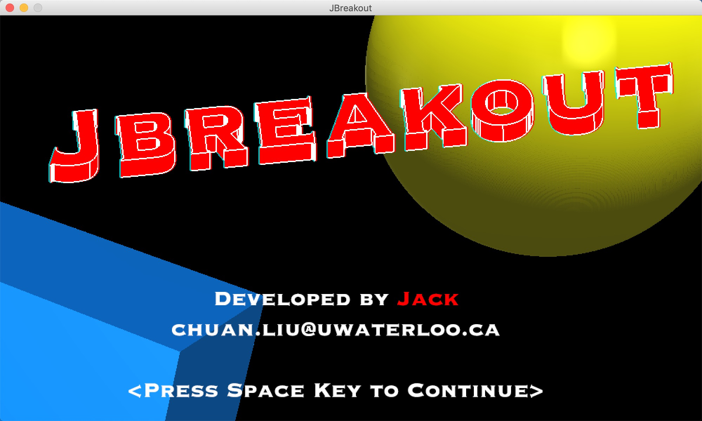
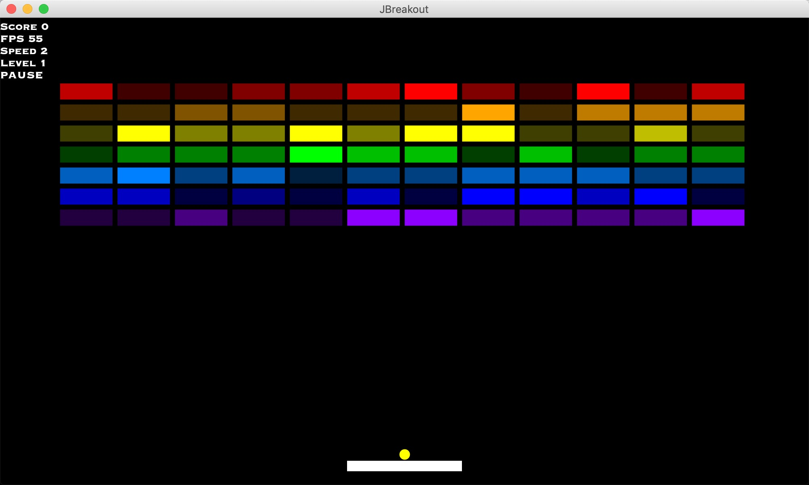
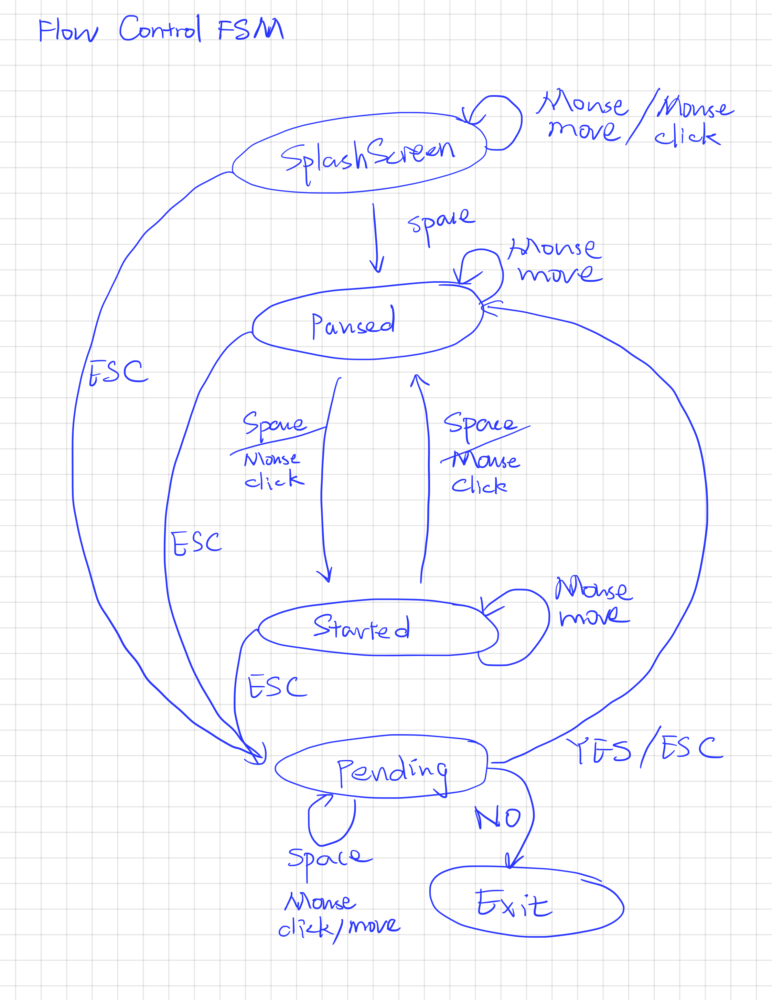

# JBreakout :construction:

### This application is developed in/for macOS

### Get Started

Run the following command in the root directory of the project:

```
gradle build
gradle run
```

### Additional features

   1. Brick vibration
   2. Bricks with different health
   3. Game levels
   4. Game pause (by pressing space key)
   5. Real time FPS

### Screenshot of the game





### Game flow control FSM


